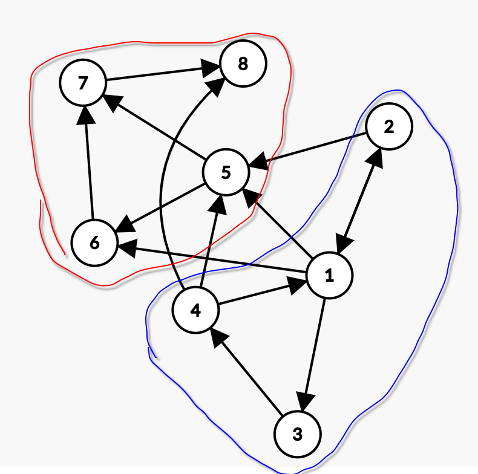

# Cohesion and Coupling

1.Given the file cohesionAndCoupling.py each class which we view as modules, has access to some attribute, how can we rewrite the classes, such that we minimize coupling and keep the access to all attributes?

2. Given this Graph, where each node represents a module and each directlional arrow how can one optimize cohesion and coupling where red and blue are each moduels?

solution: the dependancy 1,6 and 4,8 should be avoided, if thats possible the both modules only communicate via 5 wich could work as a interface between the modules
making things even simples, 4,5 and 2,5 could also be elminated such that both modules only communicate from 1 to 5

3. Can you think of reasons why your suggestions from 2 cant be implemented?

solution: if the nodes represent files then moving the logic from 4,5 to 1 and 2,5 to 1 might result in 1 becoming a very large file thus increasing complexity. if we try to introduce some kind of intermediarey between the moduels , like an interface it might end up in unnecessary redundant code

3. name 2 good types of cohesion and 2 bad types 
good: sequential, similiar functionality, communication
bad: logical,arbitrary,temporal

# Solid 

1. what does solid stand for ? provide some examples for the letters
Single responsibility: any entity ( function, class, file ,ect) should have only one single responsibility
open / closed principle: pre-existing code should be closed for modification but open for extension
Lipskovs substitution principle: any suberclass could be substituted by any of its subclasses, meaning, the preconditions of the superclass must be wider than those of the sublcasses and the postconditions must be stronger than any of its subclasses
interface seggregation: clients should not use interfaces that they dont need
dependancy aversion: depend on abstractions not implementation

# General questions

1.Why is high coupling something potentially bad ?
it leads to shotgun surgery and makes it hard to reason reliably about our system